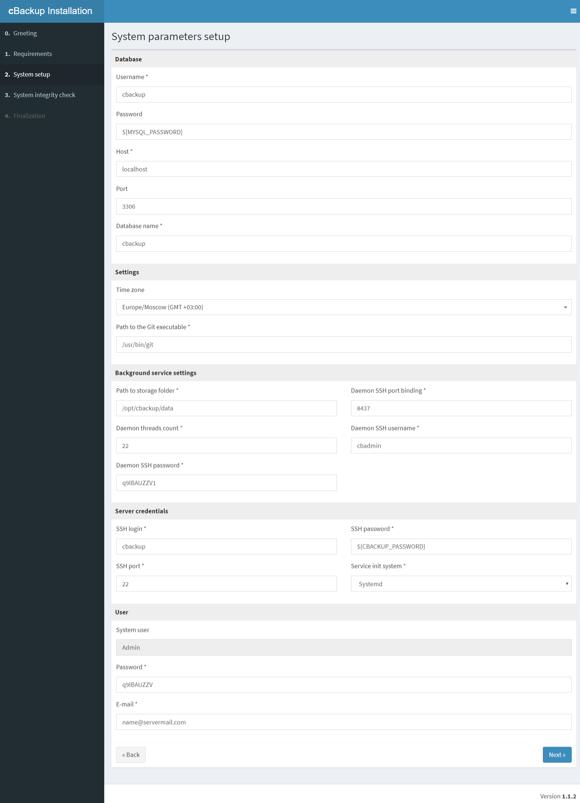

# Проект для запуска [cbackup](https://cbackup.me/en/) в контейнере docker
### Клонируем проект
```shell
git clone https://github.com/ErshovSergey/cbackup-docker-compose.git
```
### Правим настройки  
В файле *.env* укажите необходимые данные.  
Если файла нет то необходимо скопировать *.env-default* в *.env*  

### Команды
Посмотреть параметры docker-compose
```shell
docker-compose config
```
Собрать и запустить docker-compomose
```shell
docker-compose up --build -d --force-recreate
```
Остановить
```shell
docker-compose down -v --remove-orphans
```
Остановить и удалить контейнер
```shell
docker-compose down -v --rmi all --remove-orphans
```

### Первоначальная настройка  
После установки необходимо инициализировать базу sql и каталог cbackup.  
```
docker exec -i -t cb.erchov.ru_cbackup /opt/init.sh
```
Настройки производить в соответствии с  
  

#### Настройка Device auth templates для RouterOS (mikrotik)
  
